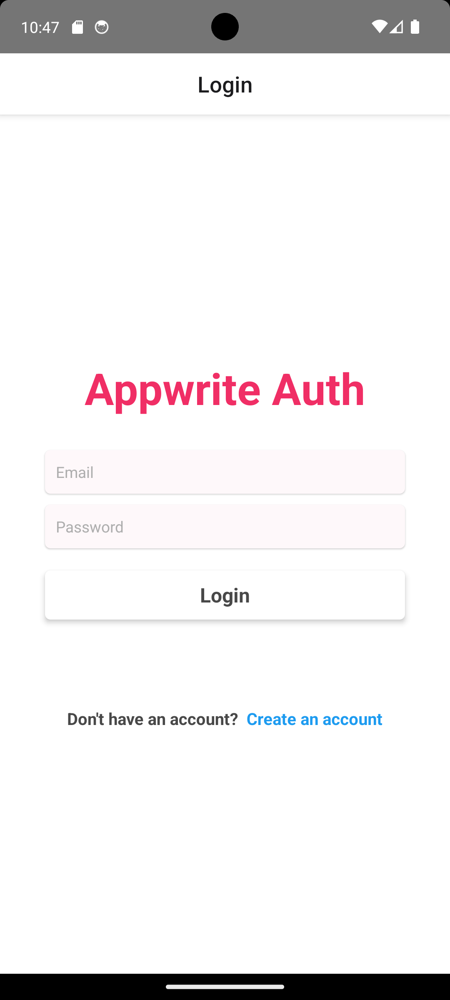

Certainly! If you want a concise Markdown code snippet that you can directly copy and paste into your `README.md` file, here it is:

````markdown
# Your Project Name

Brief project description goes here.

## Table of Contents

- [Getting Started](#getting-started)
  - [Prerequisites](#prerequisites)
  - [Installation](#installation)
- [Usage](#usage)
- [Appwrite Authentication](#appwrite-authentication)
- [Screenshots](#screenshots)
- [Contributing](#contributing)

## Getting Started

### Prerequisites

- Node.js and npm installed
- React Native CLI installed
- Appwrite server and project set up

### Installation

1. Clone the repository
   ```bash
   git clone https://github.com/your-username/your-project.git
   ```
````

2. Navigate to the project directory

   ```bash
   cd your-project
   ```

3. Install dependencies
   ```bash
   npm install
   ```

## Usage

Describe how to use your project, and provide any necessary instructions.

## Appwrite Authentication

Add Your Credentials in .env file

```md
APPWRITE_PROJECT_ID=''
APPWRITE_API_URL=''
```

## Screenshot



## Contributing

If you want to contribute to this project and make it better, your help is very welcome. Submit a pull request or open an issue.

```

Copy this code and replace the placeholders with your actual project information. Make sure to place the actual screenshots in the `assets` folder and update the image file names in the README.
```
